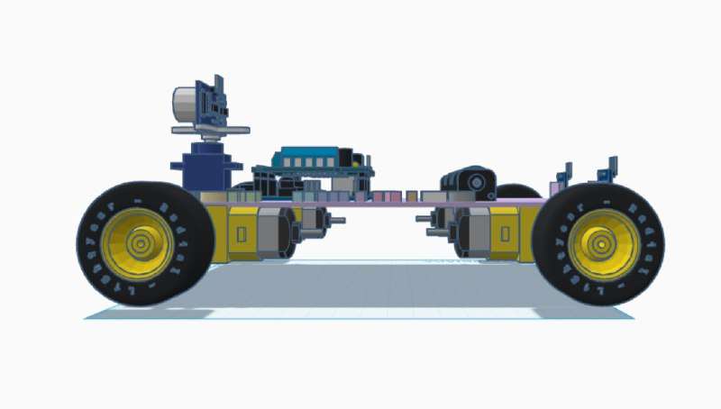

# TECH FAIRIES 3D Model

# Component Breakdown

This document provides a detailed list of all electronic and mechanical components represented in the 3D model of our autonomous cart robot.

***

##  **1. Electronics and Control** (The Brain)

* **Control Board (MCU):** **Arduino Uno**
    * *Role:* The main microcontroller responsible for executing the robot's logic and algorithms.
* **Motor Driver:** **Motor Shield**
    * *Role:* An expansion board mounted atop the Arduino, dedicated to controlling the **speed and direction** of the four drive motors.
* **Distance Sensor (Eyes):** **HC-SR04 Ultrasonic Sensor**
    * *Role:* Used for accurately measuring the distance to surrounding objects, enabling **obstacle avoidance**.
* **Sensor Actuator:** **Mini Servo Motor**
    * *Role:* Allows the ultrasonic sensor to **rotate and scan** the environment, expanding the field of detection.
* **Power Supply:** **Battery Holder / Battery Pack**
    * *Role:* The designated source of electrical energy for the robot's autonomous operation.

---

##  **2. Mechanics and Structure** (The Body)

| Element | Specification / Role |
| :--- | :--- |
| **Locomotion System** | **4WD Platform** (4 Wheels) |
| **Drive Components** | Four **Gear Motors** (Yellow) providing drive to each wheel. |
| **Chassis** | **Two-Level Platform** (Frame) |
| **Mounting Hardware** | **Standoffs and Screws** |
| **Identification** | **"TECH FAIRIES" Label** |

