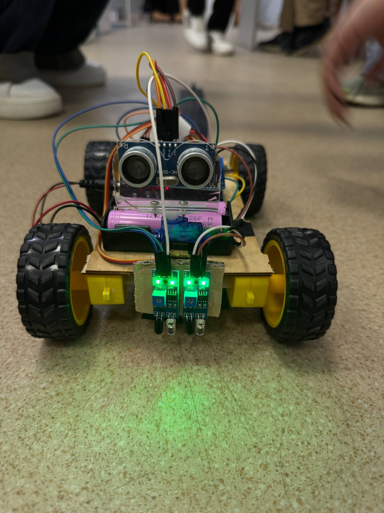
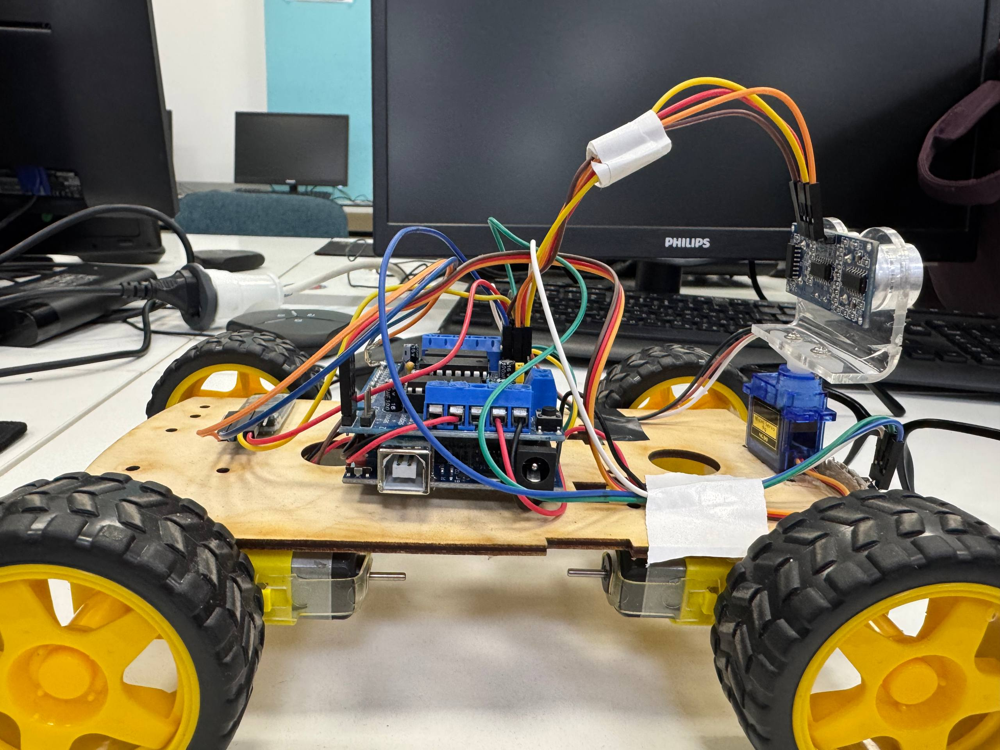
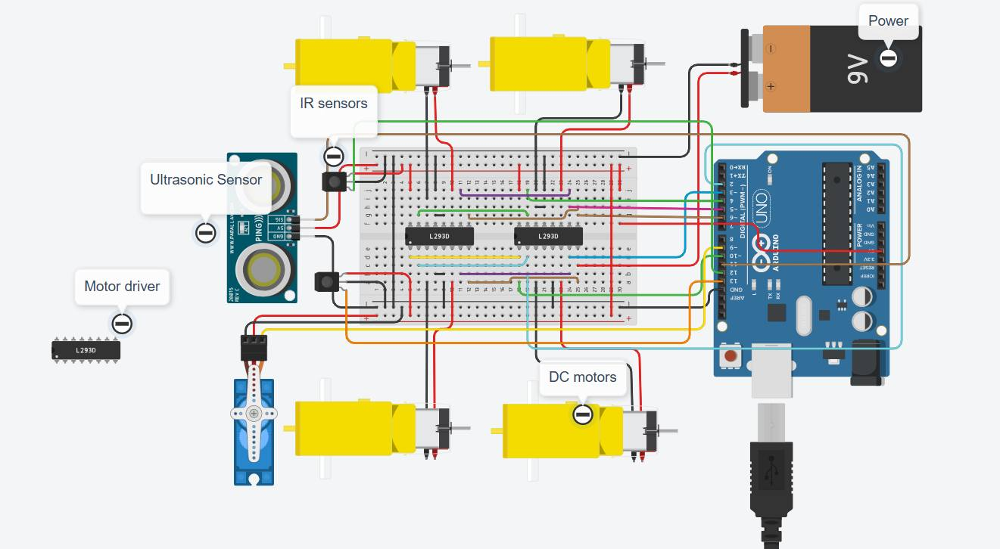

# Tech Fairies — Autonomous Robot

## Description
The robot is built on **Arduino**, equipped with **four motors**, **two line IR sensors**, an **ultrasonic sensor on a servo**, and a **Bluetooth module**.  
It can interact autonomously with its environment and perform various tasks, including line following and obstacle avoidance.

> Full details about assembly, wiring, components, and code are provided in the [Documentation](./Documentation/Documentation.md).

---

.

.

## Main Features

### Line Following
The robot uses **2 line IR sensors** to navigate:  
- **White surface** → moves forward  
- **Black surface** → stops  

### Obstacle Avoidance
The **HC-SR04 ultrasonic sensor** on a servo allows the robot to:  
- detect obstacles  
- stop and move slightly backward if needed  
- scan the area left and right  
- choose a safe direction to continue moving  

### Bluetooth Control
With the **HC-05 module**, the robot can receive the following commands:

| Command | Action      |
|---------|------------|
| F       | Forward    |
| B       | Backward   |
| L       | Turn left  |
| R       | Turn right |
| S       | Stop       |

---

## 3D Model
The complete 3D model of the robot is created in **TinkerCAD**, showing the structure of all components:  

 

[3D Model Tech Fairies](https://www.google.com/url?q=https://www.tinkercad.com/things/fstViYy1P9D/edit?returnTo%3D%252Fdashboard%252Fcollections%252FeZgqgnvjpSY%252F3d&sa=D&source=editors&ust=1765123325273558&usg=AOvVaw0RorRAl4g6BI-XW940vZ0z)

---

## Circuit Diagram
The wiring and connections diagram is available in **TinkerCAD**:  

 

[Circuit Diagram](https://www.tinkercad.com/things/h6YwGCP9HN5-shiny-robo/editel?returnTo=https%3A%2F%2Fwww.tinkercad.com%2Fdashboard&sharecode=bESzTUU_fb59zaS0xiuV8ZJ-GbVXSazhXQoIXQs_vr8)

---

## Video Demonstration
A demonstration of the robot in action:  
[YouTube](https://youtube.com/shorts/G4Z6CIAt2s8?si=E3beH1C6xB5_kXdD)

---

## Project Purpose
The project demonstrates the integration of **mechanics, electronics, sensors, and programming**.  
The robot performs autonomous movement, responds to obstacles, follows a line, and can be controlled via Bluetooth.  

---

## Setup and Installation

To replicate this project, follow these steps:

### 1. Hardware Assembly
The complete wiring is detailed in the [Documentation](./Documentation/Documentation.md).

* **Mechanical:** Assemble the chassis and mount the motors, wheels.
* **Wiring:** Connect all components to the Arduino UNO via the Adafruit Motor Shield as described in the technical documentation.

### 2. Software Requirements
You must install the following libraries in the Arduino IDE:

1.  **`Servo.h`** (Standard Arduino Library)
2.  **`AFMotor.h`** (Adafruit Motor Shield V1 Library)

To install: Open Arduino IDE → *Sketch → Include Library → Manage Libraries*, then search for and install `AFMotor`.

### 3. Code Upload
1.  Open the main code file (`sketch_apr19a.ino`) in the Arduino IDE.
2.  Connect the Arduino board to your computer.
3.  Select the correct board and port (`Tools` menu).
4.  Upload the code to the Arduino.

 ## Team Contribution

The project was executed with the following distribution of roles and responsibilities:

### Mamadzanova Amina:
* Developed the core control code for the robot.
* Performed soldering of electronic components and wires to ensure reliable connections.
* Authored the complete technical documentation for the project.

### Mitalipova Saiida:
* Assembled the mechanical structure of the robot.
* Implemented and configured the "Obstacle Avoidance" mode.
* Configured and tested the Bluetooth module (HC-05).

### Mekishova Seyil:
* Developed the 3D model of the robot (in TinkerCAD).
* Implemented and configured the "Line Following" mode.
* Conducted overall testing, debugging, and fault elimination across all robot systems.
